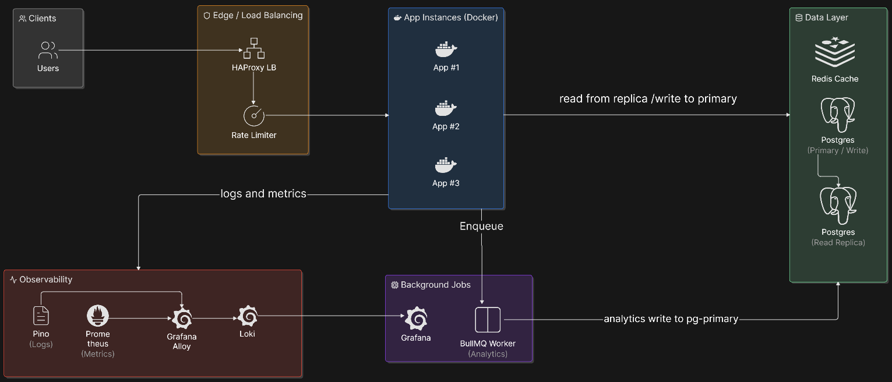
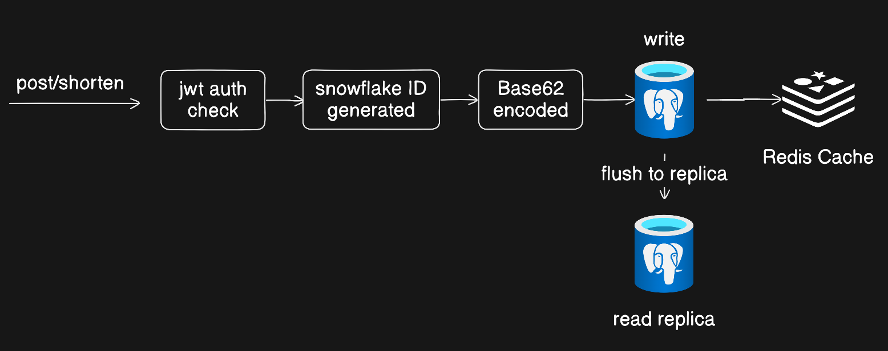
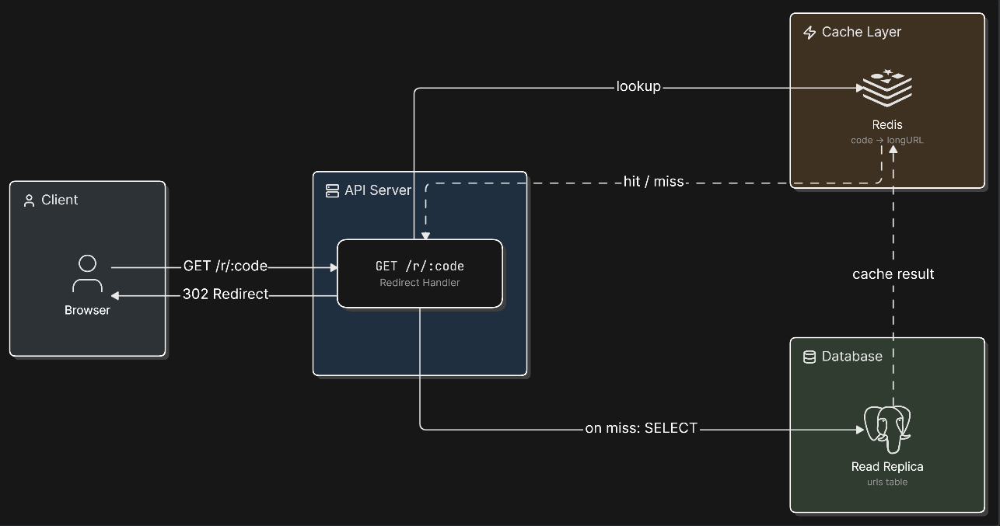
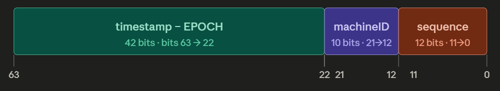
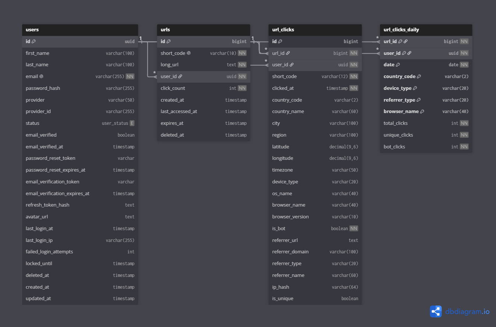

 # Distributed URL Shortener

**A URL shortener that evolved from a single-node prototype into a horizontally scaled, observable, load-tested distributed system.**


---

## Table of Contents

- [Why this project exists](#why-this-project-exists)
- [System architecture](#system-architecture)
- [From prototype to distributed system](#from-prototype-to-distributed-system)
- [Engineering deep dives](#engineering-deep-dives)
- [Load testing methodology](#load-testing-methodology)
- [Results: before vs after scaling](#results-before-vs-after-scaling)
- [The most important finding](#the-most-important-finding-read-path-vs-write-path)
- [What the stress test proved](#what-the-stress-test-proved)
- [Honest limitations](#honest-limitations)
- [Running it yourself](#running-it-yourself)
- [What I'd do next](#what-id-do-next)

---

## Why this project exists

I started with a single Node.js process, one Postgres instance, and a naive Redis cache then deliberately pushed it through every stage a real backend team goes through: finding the actual bottleneck under load, scaling horizontally, adding observability, and load-testing the result honestly, including the parts that didn't pass on the first try.

---

## System architecture



**Request flow:**

- **`POST /shorten`** 

    

- **`GET /r/:code`** 

    
    
    Every read goes to the replica, not the primary, writes never contend with the redirect hot path.

- **Every redirect** also enqueues a click event to BullMQ, processed asynchronously by a separate worker so analytics writes never block the response the user is waiting on.

- **Snowflake ID structure**

    - 42 bits: timestamp
    - 10 bits: machineID
    - 12 bits: sequence(counter) -> 0 - 4095 sequence numbers can be generate per second simultaneously, 4096 snowflake IDs can be generated per second.

    

- **Machine ID leasing** across three app instances are managed through Redis-based claim at startup.
    
---

## Database Design

  

---

## From prototype to distributed system

| | v1 — Prototype | v2 — Current system |
|---|---|---|
| App instances | 1 | 3, behind HAProxy |
| Load balancing | None | HAProxy, health-checked |
| Database | Single PostgreSQL | Primary + read replica, reads/writes routed separately |
| Cache | Redis, blocking calls, tested with 1 hot key | Redis cache-aside, non-blocking writes, rate limiter |
| ID generation | Snowflake, single machine ID | Snowflake, multi-instance-safe |
| Analytics | None | Async pipeline via BullMQ workers |
| Auth | None | JWT-based |
| Observability | `console.log` | Pino structured logs → Loki, Prometheus metrics, Grafana dashboards, Alloy |
| Migrations | Manual SQL | Knex migrations |
| Load testing | autocannon, single scenario | k6 smoke / load / stress suites, run locally |
| Deployment | Manual `node server.js` | Dockerized, docker-compose orchestrated |

---

## Engineering deep dives

### The Redis mistake that shaped this whole project

The original prototype's first Redis benchmark was *worse* than no cache at all — throughput dropped from ~3,440 req/s to ~320 req/s the moment Redis was pointed at a cloud instance (Upstash). Root cause: every cache read now paid a real network round trip (~20ms) on top of a Postgres query that was already answering in 2–5ms locally. Redis wasn't the problem, remote Redis for a workload that didn't need it was.

Switching to a local Redis instance recovered some of that, but still landed at ~1,600 req/s still below the no-cache baseline, because the cache code was doing sequential blocking calls (`await redis.get()` → `await db.query()` → `await redis.set()`) and testing against a single hot key that Postgres was already serving fast from its own buffer cache.

**The actual fix wasn't "add more cache," it was understanding when cache helps at all:** Redis pays off when multiple app instances need to share one cache layer, or when the hot dataset outgrows what Postgres can hold in memory — not on a single instance with a small dataset. That insight is the reason the current architecture uses Redis as a *shared* layer across 3 instances, not a per-instance shortcut.

### Cache stampede protection
    

**The problem:** when a popular short URL's cache entry expires, every concurrent request for that code misses the cache simultaneously and hits Postgres at once — a stampede that can spike DB load in a single instant, worse than if caching didn't exist at all.

**My approach:** 
    This problem is solved through Probabilistic Early Expiration based on the short URL's click count and time of creation. Following is the classification of URLs based of click count and time of creation for assigning Time To Live (TTL).

    '''javascript
        function shouldRefresh(remainingTtl: number, originalTtl: number, beta = 1.0,): boolean {
          if (remainingTtl < 0) return true;

          const fractionRemaining = remainingTtl / originalTtl;
          const refreshProbability = Math.pow(fractionRemaining, 1 / beta);

          return Math.random() < refreshProbability;
        }

        const TTL = {
            NEW: 5 * 60,  // 5 min.
            COLD: 10 * 60,  // 10 min.
            WARM: 60 * 60,  // 1 hour
            HOT: 24 * 60 * 60,  // 24 hour
        } as const;
    '''

### Rate limiting

A Redis-backed rate limiter protects the write path (`/shorten`) and authenticated reads (`/urls-list`). Under the stress test below, this is exactly what kept the system alive at 1,000 concurrent virtual users — instead of the database queue backing up indefinitely, excess requests were rejected fast with `429`, and the system kept serving everyone else.

**Fixed Window Counter** is used via *express-rate-limit* package. Following are the reasons to use this algorithm:

- **Low Latency**: Redirection from a short URL to a long URL must happen in milliseconds. The fixed window algorithm evaluates requests instantly without needing to scan logs or process historical timestamps.
- **Memory Efficiency**: It tracks a single integer counter (and a reset timestamp) per entity (e.g., User ID or IP address), which is incredibly cheap to maintain in high-speed in-memory caches like Redis.
    

### Read replica routing

Reads (`GET /r/:code`, `GET /urls-list`) are routed to the Postgres read replica; writes (`POST /shorten`) go to the primary. This is the single biggest reason the redirect path held up cleanly under load while the write path became the bottleneck — see [the most important finding](#the-most-important-finding-read-path-vs-write-path) below.

---

## Load testing methodology

Tests were written in **k6** across three scenarios, each targeting a different question:

| Suite | Question it answers | Profile |
|---|---|---|
| **Smoke** | Does the system function correctly at all? | 1 VU, 30s, full user journey (login → shorten → redirect → list → auth rejection) |
| **Load** | Does it hold up at realistic sustained traffic? | Ramps to 200 VUs, holds for 3 min, 80% redirect / 15% shorten / 5% list — mirrors real read-heavy traffic |
| **Stress** | Where does it break, and does it break safely? | Ramps to 1,000 VUs (5x expected peak), holds for 3 min, accepts `429`/`503` as correct "handled" responses |

A **soak test** (sustained moderate load over hours, designed to catch memory leaks and slow degradation) exists in the test suite but was not run as it requires multi-hour dedicated hardware that wasn't available at the time. This is a known gap, not a hidden one; see [limitations](#honest-limitations).

---

## Results: before vs after scaling

The original prototype was benchmarked with **autocannon** (raw connection flooding, no think time). The current system is benchmarked with **k6** (realistic user journeys with randomized think time between actions). These tools measure different things, so the numbers below are shown side by side for context, not as a strict apples-to-apples comparison.

### v1 — Prototype (autocannon, single instance)

| Scenario | Requests/sec | Avg latency | p99 latency |
|---|---|---|---|
| No cache | ~3,440 | ~28ms | ~50ms |
| Redis (cloud/Upstash) | ~320 | ~300ms | — |
| Redis (local) | ~1,600 | ~62ms | — |

### v2 — Current system (k6, 3 instances + HAProxy + replica + Redis)

**Smoke test** — 1 VU, correctness check:

| Metric | Result |
|---|---|
| Checks passed | 178/178 (100%) |
| Requests failed | 0.00% |
| p95 latency | 49.98ms |
| Avg latency | 26.66ms |

Every endpoint: login, shorten, redirect, authenticated list, and the negative auth-rejection case — passed cleanly. This is the system correctly gating on JWT auth and returning the right status codes across the full user journey.

**Load test** — ramped to 200 VUs, held for 3 minutes:

| Metric | Result | Threshold | Status |
|---|---|---|---|
| Total requests | 66,663 | — | — |
| Sustained throughput | 184.6 req/s | — | — |
| `http_req_failed` (protocol-level) | 0.00% | <1% | ✅ pass |
| Overall p95 latency | 212.79ms | <300ms | ✅ pass |
| Overall p99 latency | 480.83ms | <500ms | ✅ pass |
| **`redirect` p99** | **468.69ms** | <50ms | ❌ **fail** |
| **`shorten` p99** | **526.73ms** | <300ms | ❌ **fail** |
| Check failure rate | 19.15% | — | see analysis below |

**Stress test** — ramped to 1,000 VUs (5x expected peak), held for 3 minutes:

| Metric | Result | Threshold | Status |
|---|---|---|---|
| Total requests | 206,208 | — | — |
| Sustained throughput | 341.9 req/s | — | — |
| `http_req_failed` (protocol-level) | 1.28% | <20% | ✅ pass |
| Checks passed (accepting 429/503 as "handled") | 98.57% | — | ✅ |
| p95 latency | 4.02s | <2s | ❌ fail |
| Interrupted iterations | 143 / 206,201 (0.07%) | — | — |

---

## The most important finding: read path vs. write path

The load test's threshold failures aren't noise, they isolate exactly where the bottleneck is, and the breakdown is unusually clean:

**Every single `redirect` check passed** at 200 sustained virtual users zero failures on the read path. The Redis cache and read replica did their job; the endpoint most real users actually hit (following a short link) never degraded functionally, even though its p99 latency threshold (an admittedly aggressive 50ms target) wasn't met.

**All 12,767 check failures came from `shorten` and `list_urls`** the two endpoints that go through JWT auth, hit the Postgres primary, and sit behind the rate limiter. This is consistent with the rate limiter correctly throttling repeated requests: the k6 load test authenticates a small, fixed pool of test users and reuses their tokens across all 200 virtual users, meaning many VUs share the same rate-limit identity and legitimately get throttled under concurrent hammering, this is very likely a test-design artifact (shared tokens), not a production capacity failure. Worth validating with a per-status-code breakdown in a future test run, which I've noted below as a next step.

**Conclusion:** the system's read-heavy hot path which is the vast majority of real-world URL shortener traffic scales cleanly under load. The write path, protected by the rate limiter, is the harder problem, which is exactly the pattern seen in production systems like Bitly: reads dominate and are easy to cache; writes are inherently harder to horizontally scale without additional work (e.g., buffering writes through a queue instead of writing synchronously).

---

## What the stress test proved

At 5x expected peak load (1,000 VUs), the system did not fall over it degraded on purpose. `http_req_failed` (true protocol-level failures timeouts, connection resets) stayed at just 1.28%, and 98.57% of all requests were "handled" correctly, meaning the rate limiter was returning fast `429` responses instead of letting requests queue indefinitely and eventually time out. Only 0.07% of iterations were forcibly interrupted during the ramp-down.

That's the difference between a system that **fails safely** and one that **falls over** — and it's a direct result of the rate limiter doing its job under real pressure, not just existing in code that was never tested against load.

The p95 latency threshold (2s) was missed — actual p95 was 4.02s — which is an honest signal that under 5x peak, requests that *do* get through are slow, even if they don't fail outright. That's a real, useful data point for capacity planning, not something to hide.

---

## Honest limitations

- **No soak test run yet.** The suite exists (`tests/tests-after-scaling/`) but wasn't executed. Soak tests need hours of sustained load on dedicated hardware to catch memory leaks and slow degradation, which wasn't available. 
- **Not yet deployed**, this runs via Docker locally. A cloud deployment (with multi-region read replicas, real DNS, and a CDN in front of redirects) is the next milestone.

---

## Running it yourself

```bash
git clone https://github.com/Muhammad-Hasan5/URL-Shortener.git
cd URL-Shortener
cp .env.example .env   # fill in secrets
docker compose up -d --build
```

Health check: `curl http://localhost:8080/health/ready`

Load tests (requires [k6](https://k6.io/docs/get-started/installation/) installed locally):

```bash
k6 run tests/tests-after-scaling/smoke.test.js
k6 run tests/tests-after-scaling/load.test.js
k6 run tests/tests-after-scaling/stress.test.js
```

---

## What I'd do next

- Run the soak test on a free-tier cloud VM to check for memory leaks over hours, not minutes
- Buffer `POST /shorten` writes through BullMQ (already used for analytics) so the client-facing response time is decoupled from Postgres primary write latency
- Deploy to a real cloud environment and re-run all three suites against dedicated infrastructure for a true throughput ceiling
- Add a CDN in front of redirects for permanent (301) short URLs, so most redirects never reach the origin at all

---

*Built as a portfolio project to learn how backend systems actually behave under load.*
